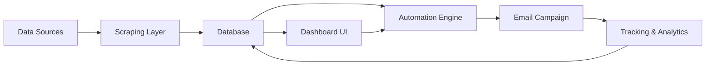

## Project Overview

**Duration:** 4-5 Weeks  
**Modules:** Scraping → Storage → Dashboard → Email → Automation

---

## 🏗️ System Architecture

### High-Level Flow



### Architecture Layers

#### 1. Data Collection Layer

- **Apify Integration**
    - Actor triggers
    - Input schema configuration
    - Result processing pipeline
- **Apollo API Integration**
    - Industry filtering
    - Location-based queries
    - Company size filtering
    - Job title targeting
- **Features**
    - Script switching mechanism
    - Run logging system
    - Duplicate prevention logic
    - Dashboard controls (Start/Stop)

#### 2. Storage Layer

- **Database Schema**
    - `Companies` table
    - `Contacts` table
    - `Industries` table
    - `Runs` table (execution logs)
    - `Sources` table
    - `Campaigns` table
- **Data Management**
    - Data cleaning & normalization
    - Import/Export (CSV/XLSX)
    - Search & filtering backend
    - Duplicate detection

#### 3. Dashboard Layer

- **Tech Stack:** React or Next.js
- **Pages**
    - Data View
    - Scripts Manager
    - Campaign Manager
    - Analytics Dashboard
- **Features**
    - Dynamic modular UI
    - Real-time logs viewer
    - User roles (Admin/Editor/Viewer)
    - API integration panel

#### 4. Email Campaign Module

- **Components**
    - Template builder
    - Segmentation filters
    - Daily sending limits
    - Tracking system (Open/Click/Bounce)
    - Scheduling system

#### 5. Automation Engine (n8n)

- **Workflows**
    - Scraping → Storage automation
    - Storage → Email campaigns
    - Webhook handlers
    - Retry logic for failed jobs
- **Controls**
    - Workflow execution from dashboard
    - Log management
    - Error handling

---

## 📋 Development Phases

### Phase 1: System Architecture & Setup

**Duration:** 3-4 days

- [ ] Design final system architecture
- [ ] Create database schema
- [ ] Configure DevOps environment
- [ ] Prepare API keys & access credentials

### Phase 2: Data Collection Layer

**Duration:** 12-15 days

- [ ] Integrate Apify actors
- [ ] Implement Apollo API filtering
- [ ] Build script switching logic
- [ ] Create dashboard controls for scrapers
- [ ] Implement duplicate prevention
- [ ] Add run logging

### Phase 3: Database & Data Management

**Duration:** 3-4 days

- [ ] Create all main tables
- [ ] Implement data cleaning pipelines
- [ ] Build import/export functionality
- [ ] Set up search & filter backends

### Phase 4: Dashboard (Modular UI)

**Duration:** 1 week

- [ ] Set up React/Next.js project
- [ ] Build reusable UI modules
- [ ] Create Data View page
- [ ] Create Scripts Manager page
- [ ] Create Campaign Manager page
- [ ] Create Analytics page
- [ ] Implement real-time logs viewer
- [ ] Add user role management

### Phase 5: Email Campaign Module

**Duration:** 2 days

- [ ] Build template builder
- [ ] Implement segmentation filters
- [ ] Set up sending limits
- [ ] Add tracking (open/click/bounce)
- [ ] Create scheduling system

### Phase 6: Automation Engine

**Duration:** 3-4 days

- [ ] Configure n8n workflows
- [ ] Connect scraping to storage
- [ ] Connect storage to email
- [ ] Implement webhook handlers
- [ ] Add retry logic
- [ ] Enable dashboard execution

### Phase 7: Testing & Deployment

**Duration:** 3-4 days

- [ ] Performance testing
- [ ] Security implementation (HTTPS, encryption, rate limiting)
- [ ] Server deployment
- [ ] Documentation
- [ ] Training session

---

## 🔐 Security Features

- HTTPS encryption
- Data encryption at rest
- Rate limiting
- User authentication & authorization
- Role-based access control (RBAC)

---

## 📊 Database Schema

### Companies Table

```sql
- id (PK)
- name
- industry_id (FK)
- location
- size
- website
- source_id (FK)
- created_at
- updated_at
```

### Contacts Table

```sql
- id (PK)
- company_id (FK)
- first_name
- last_name
- email
- job_title
- phone
- created_at
- updated_at
```

### Industries Table

```sql
- id (PK)
- name
- description
```

### Runs Table

```sql
- id (PK)
- script_name
- status
- records_collected
- started_at
- completed_at
- error_log
```

### Sources Table

```sql
- id (PK)
- name
- type (Apify/Apollo/Manual)
- config
```

### Campaigns Table

```sql
- id (PK)
- name
- template_id
- segment_filter
- status
- scheduled_at
- sent_count
- open_rate
- click_rate
- created_at
```

---

## 🔄 Workflow Examples

### Workflow 1: Data Collection

```
Trigger: Manual/Scheduled
→ Select Data Source (Apify/Apollo)
→ Configure Filters
→ Execute Scraper
→ Process & Clean Data
→ Check for Duplicates
→ Store in Database
→ Log Results
→ Notify User
```

### Workflow 2: Email Campaign

```
Trigger: Manual/Scheduled
→ Select Campaign
→ Apply Segment Filters
→ Load Contact List
→ Check Daily Limits
→ Send Emails (Batch)
→ Track Opens/Clicks
→ Update Campaign Stats
→ Log Activity
```

---

## 🛠️ Tech Stack

|Layer|Technology|
|---|---|
|Frontend|React / Next.js|
|Backend|Node.js / Python|
|Database|PostgreSQL / MySQL|
|Automation|n8n|
|Scraping|Apify + Apollo API|
|Deployment|Client-hosted / Cloud|
|Security|HTTPS, Encryption|

---

## 📈 Scalability

- **Modular Architecture:** Each module can be modified without affecting others
- **Data Source Expansion:** Easy to add new scraping sources
- **Horizontal Scaling:** Database and API can scale independently
- **Performance Optimization:** Caching, indexing, and query optimization

---

## 💰 Pricing Breakdown

### Full System: $600

✔ Scraping automation (Apify + Apollo)  
✔ Database setup & management  
✔ Dashboard (Modular UI)  
✔ Email campaigns  
✔ Automation workflows (n8n)  
✔ User roles + security  
✔ Deployment + documentation

### Maintenance Plan: $50/month (Optional)

- Fixing errors
- Monitoring workflows
- Performance tuning
- 5-10 hours of development per month

---

## 📝 Notes

- Each module is 100% independent
- System is expandable for additional data sources
- Includes testing, performance optimization, and training
- Any module can be modified without affecting the entire system

---

## 🔗 Related Documents

- [[Project Timeline]]
- [[API Documentation]]
- [[User Guide]]
- [[Deployment Guide]]