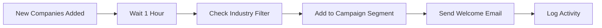

# User Guide - Modular Data Collection & Marketing Automation System

## 📚 Table of Contents

- [[#Getting Started]]
- [[#Dashboard Overview]]
- [[#Data Collection]]
- [[#Managing Data]]
- [[#Email Campaigns]]
- [[#Automation Workflows]]
- [[#User Roles & Permissions]]
- [[#Analytics & Reporting]]
- [[#Troubleshooting]]

---

## 🚀 Getting Started

### System Access

1. **Login to the Dashboard**
    
    - Navigate to your system URL
    - Enter your username and password
    - Click "Login"
2. **First-Time Setup**
    
    - Complete your profile information
    - Set your timezone preferences
    - Configure notification settings

### User Roles

|Role|Permissions|
|---|---|
|**Admin**|Full access to all features, user management, system settings|
|**Editor**|Can create, edit, and delete data, campaigns, and workflows|
|**Viewer**|Read-only access to data and reports|

---

## 🎛️ Dashboard Overview

### Main Navigation

```
┌─────────────────────────────────────┐
│  Logo    [Data] [Scripts] [Campaigns] [Analytics] [Settings]  │
└─────────────────────────────────────┘
```

### Dashboard Sections

1. **Data View** - Browse and manage collected data
2. **Scripts Manager** - Control scraping operations
3. **Campaign Manager** - Create and manage email campaigns
4. **Analytics** - View performance metrics and reports
5. **Settings** - Configure system preferences

---

## 🔍 Data Collection

### Setting Up Data Sources

#### Using Apify Integration

1. Navigate to **Scripts Manager**
2. Click **"Add New Script"**
3. Select **"Apify"** as source type
4. Configure the actor:
    
    ```yaml
    Actor Name: [Select from dropdown]Input Parameters:  - Search Query: "your search terms"  - Max Results: 100  - Country: "United States"
    ```
    
5. Click **"Save Configuration"**

#### Using Apollo API

1. Navigate to **Scripts Manager**
2. Click **"Add New Script"**
3. Select **"Apollo"** as source type
4. Configure filters:
    - **Industry:** Select target industries
    - **Location:** Choose geographic regions
    - **Company Size:** Set employee count range
    - **Job Titles:** Enter target positions
5. Click **"Save Configuration"**

### Running Data Collection

#### Manual Execution

1. Go to **Scripts Manager**
2. Find your configured script
3. Click **"Start"** button
4. Monitor progress in real-time logs
5. View results when status shows **"Completed"**

#### Scheduled Execution

1. Open script settings
2. Enable **"Schedule"** toggle
3. Set frequency:
    - Daily at specific time
    - Weekly on specific days
    - Monthly on specific date
4. Click **"Save Schedule"**

### Monitoring Runs

**Real-Time Logs:**

```
[2024-12-11 10:30:15] Script Started: Apollo_TechCompanies
[2024-12-11 10:30:45] Records Fetched: 50
[2024-12-11 10:31:00] Duplicates Removed: 5
[2024-12-11 10:31:15] Records Saved: 45
[2024-12-11 10:31:20] Status: Completed
```

**Run History:**

- View past executions
- Check success/failure rates
- Download execution logs
- Review error messages

---

## 📊 Managing Data

### Viewing Data

1. Navigate to **Data View**
2. Select data type:
    - Companies
    - Contacts
    - Industries
3. Use filters to narrow results:
    - Date range
    - Source
    - Industry
    - Location

### Searching Data

**Quick Search:**

- Enter keywords in search bar
- Press Enter or click search icon

**Advanced Filters:**

```
Filter Options:
├── Company Name
├── Industry
├── Location
├── Employee Count
├── Date Added
└── Source Type
```

### Exporting Data

1. Apply desired filters
2. Click **"Export"** button
3. Select format:
    - CSV
    - XLSX (Excel)
4. Choose fields to include
5. Click **"Download"**

### Importing Data

1. Click **"Import"** button
2. Upload CSV/XLSX file
3. Map columns to database fields:
    
    ```
    File Column → Database Field"Company"   → company_name"Email"     → contact_email"Phone"     → contact_phone
    ```
    
4. Review preview
5. Click **"Import"**

### Editing Records

**Single Record:**

1. Click on any record
2. Modify fields
3. Click **"Save"**

**Bulk Edit:**

1. Select multiple records (checkboxes)
2. Click **"Bulk Actions"**
3. Choose action:
    - Update field
    - Assign to campaign
    - Delete
4. Confirm action

---

## ✉️ Email Campaigns

### Creating a Campaign

#### Step 1: Campaign Setup

1. Navigate to **Campaign Manager**
2. Click **"New Campaign"**
3. Enter campaign details:
    
    ```yaml
    Campaign Name: "Q1 Outreach"Subject Line: "Collaboration Opportunity"From Name: "Your Name"From Email: "your@email.com"
    ```
    

#### Step 2: Build Email Template

**Using Template Builder:**

1. Click **"Create Template"**
2. Choose template type:
    - Blank template
    - Pre-built template
3. Customize content:
    - Add text blocks
    - Insert images
    - Add buttons/links
4. Use personalization tags:
    
    ```
    Available Tags:{{first_name}}{{last_name}}{{company_name}}{{job_title}}{{custom_field}}
    ```
    

**Example Template:**

```html
Hi {{first_name}},

I noticed {{company_name}} is doing great work in the {{industry}} space.

I'd love to discuss how we can collaborate.

Best regards,
[Your Name]
```

#### Step 3: Select Recipients

**Segmentation Options:**

1. Click **"Select Audience"**
2. Apply filters:
    
    ```
    Segment Criteria:├── Industry: Technology├── Location: United States├── Company Size: 50-200 employees└── Job Title: Contains "Manager"
    ```
    
3. Review contact count
4. Click **"Save Segment"**

#### Step 4: Configure Settings

```yaml
Daily Sending Limit: 100 emails/day
Schedule:
  - Start Date: 2024-12-15
  - Time: 09:00 AM
  - Timezone: America/New_York
Follow-up: 
  - Enable: Yes
  - Days After: 3
  - Only if no response
```

#### Step 5: Launch Campaign

1. Review campaign summary
2. Send test email (recommended)
3. Click **"Launch Campaign"**
4. Monitor in real-time

### Tracking Campaign Performance

**Key Metrics:**

|Metric|Description|
|---|---|
|**Sent**|Total emails sent|
|**Delivered**|Successfully delivered|
|**Opened**|Recipients who opened|
|**Clicked**|Recipients who clicked links|
|**Bounced**|Failed deliveries|
|**Unsubscribed**|Opt-outs|

**Viewing Results:**

1. Go to **Campaign Manager**
2. Click on campaign name
3. View dashboard with:
    - Overall statistics
    - Individual contact activity
    - Link click tracking
    - Geographic distribution
    - Time-based engagement

---

## ⚙️ Automation Workflows

### Understanding Workflows

Workflows connect different system modules to automate repetitive tasks.

**Common Workflow Types:**

1. **Data Collection → Storage**
    
    - Automatically save scraped data
    - Clean and normalize entries
    - Remove duplicates
2. **Storage → Email Campaigns**
    
    - Trigger campaigns when new data arrives
    - Auto-segment contacts
    - Schedule follow-ups
3. **Campaign → Analytics**
    
    - Track email performance
    - Update contact records
    - Generate reports

### Creating a Workflow

#### Basic Workflow Setup

1. Navigate to **Automation** section
2. Click **"New Workflow"**
3. Choose trigger:
    
    ```
    Trigger Options:├── Time-based (Schedule)├── Data-based (New records added)├── Action-based (Campaign completed)└── Webhook (External event)
    ```
    

#### Example: Auto-Email Workflow

**Workflow Steps:**



**Configuration:**

1. **Trigger:** New companies added to database
2. **Filter:** Industry = "Technology"
3. **Action:** Add to "Tech Outreach" campaign
4. **Schedule:** Send email next day at 10 AM
5. **Follow-up:** If no response after 3 days, send follow-up

### Managing Workflows

**Starting/Stopping:**

- Toggle workflow status: Active/Inactive
- Workflows can be paused without losing configuration

**Monitoring:**

- View execution history
- Check success/failure rates
- Review error logs
- See processing time

**Editing:**

- Modify triggers
- Update conditions
- Change actions
- Adjust timing

---

## 👥 User Roles & Permissions

### Managing Users (Admin Only)

#### Adding New Users

1. Go to **Settings** → **Users**
2. Click **"Add User"**
3. Enter user details:
    
    ```yaml
    Name: John DoeEmail: john@company.comRole: EditorPassword: [Auto-generated or custom]
    ```
    
4. Click **"Send Invitation"**

#### Editing User Permissions

1. Find user in list
2. Click **"Edit"**
3. Modify role or specific permissions
4. Click **"Save Changes"**

### Permission Matrix

|Feature|Admin|Editor|Viewer|
|---|---|---|---|
|View Data|✅|✅|✅|
|Edit Data|✅|✅|❌|
|Delete Data|✅|✅|❌|
|Run Scripts|✅|✅|❌|
|Create Campaigns|✅|✅|❌|
|View Analytics|✅|✅|✅|
|Manage Users|✅|❌|❌|
|System Settings|✅|❌|❌|
|Export Data|✅|✅|✅|

---

## 📈 Analytics & Reporting

### Dashboard Analytics

**Overview Metrics:**

```
┌─────────────────────────────────────┐
│  Total Companies:        1,234      │
│  Total Contacts:         5,678      │
│  Active Campaigns:       12         │
│  Emails Sent (30d):      4,500      │
└─────────────────────────────────────┘
```

### Data Collection Reports

1. Navigate to **Analytics** → **Data Collection**
2. View metrics:
    - Records collected per day/week/month
    - Source performance comparison
    - Data quality scores
    - Duplicate detection rates

### Campaign Reports

**Standard Reports:**

- **Campaign Performance Summary**
    
    - All campaigns comparison
    - Success rates
    - ROI metrics
- **Email Engagement Report**
    
    - Open rates over time
    - Click-through rates
    - Best performing content
- **Contact Activity Report**
    
    - Most engaged contacts
    - Inactive contacts
    - Segmentation performance

### Exporting Reports

1. Select report type
2. Choose date range
3. Click **"Export Report"**
4. Select format (PDF, CSV, XLSX)
5. Download file

---

## 🔧 Troubleshooting

### Common Issues

#### Scraping Not Working

**Problem:** Script fails to run or returns no data

**Solutions:**

1. Check API credentials are valid
2. Verify internet connectivity
3. Review error logs for specific issues
4. Check if data source has rate limits
5. Contact support if issue persists

#### Emails Not Sending

**Problem:** Campaign shows as active but no emails sent

**Solutions:**

1. Verify email credentials (SMTP settings)
2. Check daily sending limits not reached
3. Ensure contacts have valid email addresses
4. Review spam filter settings
5. Check if domain is blacklisted

#### Dashboard Loading Slowly

**Problem:** Pages take long time to load

**Solutions:**

1. Clear browser cache
2. Check internet connection speed
3. Reduce number of records displayed per page
4. Use more specific filters
5. Contact admin for server optimization

#### Data Not Appearing

**Problem:** Collected data not showing in dashboard

**Solutions:**

1. Refresh the page
2. Check if script completed successfully
3. Review run logs for errors
4. Verify filters are not too restrictive
5. Check user permissions

### Getting Help

**Support Channels:**

1. **In-App Help**
    
    - Click "?" icon in navigation
    - Access knowledge base
    - View video tutorials
2. **Documentation**
    
    - Technical documentation
    - API reference
    - Integration guides
3. **Contact Support**
    
    - Email: support@yourdomain.com
    - Response time: 24-48 hours
    - Include: Error messages, screenshots, steps to reproduce

---

## 📋 Best Practices

### Data Collection

- ✅ Start with small test runs before full scraping
- ✅ Schedule scraping during off-peak hours
- ✅ Regularly review and clean duplicate data
- ✅ Keep API credentials secure
- ✅ Monitor data quality metrics

### Email Campaigns

- ✅ Always send test emails before launching
- ✅ Personalize content with merge tags
- ✅ Respect daily sending limits
- ✅ Clean email lists regularly
- ✅ Monitor engagement metrics
- ✅ Include unsubscribe links
- ✅ A/B test subject lines

### System Maintenance

- ✅ Regularly export data backups
- ✅ Review workflow performance monthly
- ✅ Update user permissions as needed
- ✅ Monitor system logs for errors
- ✅ Keep documentation updated

---

## 🔗 Related Documentation

- [[System Architecture]]
- [[API Documentation]]
- [[Deployment Guide]]
- [[Project Timeline]]
- [[Troubleshooting Guide]]

---

## 📞 Support Information

**System Maintenance:** $50/month  
**Included Support:** 5-10 hours per month  
**Coverage:** Bug fixes, monitoring, performance tuning

**Need Additional Help?**  
Contact your system administrator or technical support team.

---

_Last Updated: December 2024_  
_Version: 1.0_